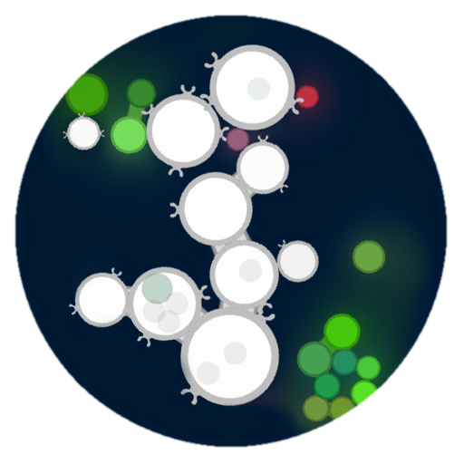

<br />
<p align="center">
  

  <h2 align="center">ProtoEvo Project V2</h2>

  <p align="center">
    <i>An interactive real-time simulation for evolving multicellular organisms.</i>
    <br />
    <a href="../../issues">Report Issue</a>
      &nbsp&nbsp•&nbsp&nbsp 
    <a href="../../issues">Request Feature</a>
      &nbsp&nbsp•&nbsp&nbsp  
    <a href="https://discord.com/invite/GY5UJxbBnq">Discuss on Discord</a>
  </p>
</p>

## Table of Contents

- [Introduction](#introduction)
- [Simulation Overview](#simulation-overview)
- [User Installation](#user-installation): _See for running a released EXE on Windows._
- [Installation FaQ](#installation-faq): _Having an issue running the EXE?_
- [Creating a Simulation](#creating-a-simulation)
- [Simulation Controls](#simulation-controls)
- [Developer Installation](#developer-installation)

## Introduction

The aim of this project is to create an environment where protozoa-like entities evolve their behaviours
and morphologies in order to survive and reproduce.
The simulation takes place in a 2D environment physically simulated environment. The project was the subject of a
paper that I presented at the [ALIFE 2023](https://2023.alife.org/) conference, and which you can find
[published in the ALIFE proceedings](https://direct.mit.edu/isal/proceedings/isal/35/77/116930).
If you wish to cite this work, please use the following citation:

Dylan Cope, 2023, "Real-time Evolution of Multicellularity with Artificial Gene Regulation", in the
Proceedings of the 2023 Artificial Life Conference (ALIFE 23), pp. 77-86, MIT Press.

```bibtex
@proceedings{cope2023multicellularity,
    author = {Cope, Dylan},
    title = {{Real-time Evolution of Multicellularity with Artificial Gene Regulation}},
    booktitle = {{Proceedings of the 2023 Artificial Life Conference (ALIFE 23)}},
    pages = {77-86},
    year = {2023},
    doi = {10.1162/isal_a_00690}
}
```

For the previous version of the simulation I created a YouTube video that explains the project in more detail.
Many of the mechanics have changed since then, but the video still provides a good overview of the project.
You can also come and discuss the project on [discord](https://discord.com/invite/GY5UJxbBnq)!


[](https://www.youtube.com/watch?v=fEDqdvKO5Y0)

## Simulation Overview

### Feeding and the Environment

In the following screenshot we can
see the protozoa as white circles, and the plants as green circles. The plants emit chemical pheromones that
spread through the environment, which provide nutrients and can be detected by the protozoa. The red cells are 
dead cells that emit nutrients and are rich in resources for the protozoa to feed on. The protozoa can all feed 
on cells by engulfing them, a process in real cellular biology call _phagocytosis_.


In the above screenshot we also see a brown triangle. This is a "rock"; a rigid body that forms a
procedurally generate boundaries in the environment. The next screenshot below shows a more zoomed-out view
of the environment, where we can see the rocks forming a boundary around the environment. Outside the outer
ring of rocks is a "void" in which there are no resources, and the cold, dark environment is inhospitable to life.


### Evolving Multicellularity

The primary research objective of this project is to investigate the emergence of multicellular structures,
i.e. the development of coordinated groups of attached cells that incur a survival benefit by being attached.
Further, we are interested in the emergence of cell differentiation, i.e. the development of cells that
specialise in different functions. For example, some cells may specialise in feeding, while others may specialise
in being light-sensitive, or in reproduction. The following screenshot shows a multicellular structure that
has evolved in the simulation. The two cells are bound together and are able to transmit signals to one another.
These signals are used to coordinate the feeding behaviour of the two cells, but they also regulate the development
of functions. For example, the cell on the right has developed a light-sensitive functions, whereas the cell on the
left has only developed feeding function (called phagocytosis nodes).


The cell functions are implemented using a "surface node" system and a "fuzzy lock-and-key" mechanism to
incorporate signals from a gene regulatory network (GRN) with requirements needed to create the functions.
The following diagram illustrates the surface node system with the kinds of nodes that can be constructed by a cell.


The diagram also shows part of the motivation for the surface node system in terms of the kinds of evolutionary 
dynamics that we hope to observe. This is inspired by what the Evolutionary Biologist Neil Shubin calls 
["Revolutionary Repurposing"](https://www.the-scientist.com/reading-frames/revolutionary-repurposing-67552)
in his book "Some Assembly Required". The basic idea is that the evolution of new functions is not necessarily
a process of creating new genes, but rather can be a process of repurposing existing genes. Putting them into 
new contexts and combining them in new ways. The surface node system is designed to facilitate this kind of
evolutionary process by providing common I/O interfaces for the cell functions. A cell could evolve mechanisms to 
interpret information from a photoreceptor node, for example, and use that information to regulate the behaviour
of a flagellum node. Then, by mutation of the flagellum into a cell adhesion node, the information that was previously
used to control movement could be sent to another cell. This could be used to coordinate the behaviour of a group
of cells, or to send a signal to another cell to trigger a response.

### Resource Flows

The following diagram shows the resource flows in the simulation. It highlights the importance of something in the
simulation called _complex molecules_. These serve as prerequisites for constructing various traits.
They are represented by a number in the unit interval called the molecule’s signature. The simulation only permits
a finite number of possible molecules, represented at evenly spaced intervals between 0 and 1. Complex molecules
are produced using mass and energy according to a ‘production cost‘ in terms of energy expended per unit of mass produced.
The term ‘complex molecules’ is inspired by the _Central Dogma of Molecular Biology_, that states: “DNA codes for
RNA, and RNA codes for proteins”. Complex molecules in the simulation are designed to be analogous to proteins in the
following ways; firstly, they are what ultimately implement functions in a cell. Secondly, they are involved in ‘lock-and-
key’ mechanisms that act as conditional switches. Thirdly, the choice of which complex molecules are produced is made
by the gene regulatory network.


The primary sources of mass and energy in simulation are the plant cells. Plants
are ingested by protozoan cells and converted into the stores of available energy and construction mass. Next there are
a number of different directions these resources can flow; energy can be converted into action (e.g. in the form of
movement). Mass and energy can be used to increase the cell’s supply of complex molecules to be used for later 
construction projects. Such projects themselves will also require further construction mass and energy on top of the
initial investment into the complex molecules. As mentioned before, upon a protozoan’s death its supply of resources is
distributed to meat cells spawned in its wake. This includes energy storage, construction mass, and complex molecules.
The resources can then be reclaimed by other protozoans that ingest the meat. Meat is denser in energy than plant
cells, and they present the potential to skip producing any stored complex molecules.

## Features in Development

* Optimise the physics engine.
* Lineage tracking UI tools.
* More detailed cell stats.
* An environment editor.
* More variation and environmental features.
* Running the simulation distributed across multiple machines.

## User Installation

_Note:_ Currently a packaged user-friendly version of the simulation is only available for **Windows**. If you wish to run the program on Linux or OSX you will need to follow the developer setup instructions.

To install the program on Windows, [download the installer](https://drive.google.com/file/d/1sbmkbPFfIb0PXWFLgbcZ0XJqLDAwhFes/view?usp=sharing) and run the installation process. After this, the program can be found by search for it I the windows menu (press the windows key and type "ProtoEvo").

### Installing Older Versions

1. Download the [latest release](https://github.com/DylanCope/ProtoEvo/releases) from the GitHub repository.
2. Unzip the downloaded file and place the folder somewhere you will remember.
3. Ensure that you have [Java 8](https://www.java.com/en/download/help/windows_manual_download.html) installed. Java 8 is the only version that is sure to work - other versions are mostly untested. Many later versions are known to not work.
4. Run the `ProtoEvo.exe` file. You should see the program launch.

## Installation FaQ

**Java Issues:** The most common issue with running the simulation is not having an available correct Java 8 runtime installed.
For a step-by-step tutorial for installing Java 8 on Windows 11, see [this video](https://www.youtube.com/watch?v=8knD-PZ_PuA&ab_channel=TechOnTech).

If you have specific questions, join the [project discord](https://discord.com/invite/GY5UJxbBnq) and post your 
problem in the `#help` channel.
When submitting a request for help, please provide as much information as possible.
The following information is likely to be useful:

* Your operating system and hardware information.
* The version of the program that you are trying to run (a link to the download you used would be best).
* The Java version that you are using. Enter `java -version` into the commandline to get this information.
* A zip file of your save, if you have one.
* The crash report txt file in your save folder.
* The commandline output from the program when the crash occured. If the program is crashing on
  startup then you may only see a commandline window appear briefly. In this case, you should open the commandline beforehand
  so that you can see the results after the crash. To do this, right-click in the file explorer an select 'Open in Terminal'.
  Then enter `.\ProtoEvo.exe` into the terminal.

## Creating a Simulation

### Loading and Creating Simulations

If you have set up your installation correctly, when you launch the simulation you should see the following screen:


You can load existing saves or create a new simulation. When creating a simulation you can customise many of the
parameters of the simulation. The following screenshot shows the simulation settings screen.


_Note: The "Use CUDA" requires cuda to be installed_

The default settings can only be modified by editing the `Settings` classes in the `com.protoevo.settings` module.

### Simulation Controls

After creating the simulation, you will be taken to a screen in which you can watch and interact with the simulation.
You can move the camera around, pick up cells and move them, kill cells with the lightning tool, and spawn new cells
with the cell by clicking with the middle-mouse button. If you left-click anywhere in the environment it will
create a "shockwave" that will push cells away from the point of impact. This is useful for moving around lots of cells.

If you right-click on a cell the camera will track it and the UI will display 
information about the cell, given you the option to save the cell or add a tag. Tags are a useful way to keep track
of lineages as they are attached to all future descendants of the cell. When cells are saved they are stored as `.cell`
files and can be loaded into other simulations. The following screenshot shows the simulation UI.


You can also find more information about a cell by clicking on the region in the above screenshot with
the "Protozoan Stats" text. This will open a drop-down menu where you can access different kinds of information,
such as information about each of the surface nodes on the cell.

You can also pause and resume the simulation with the space bar, or the icon in the top left of the screen.
The folder icon will open the simulation save folder. The terminal icon will disable the UI and show the 
REPL terminal. This is useful for running the simulation headless, and therefore faster. To return to the
UI, type `ui` into the terminal. If you want to run other commands, type `help` to see a list of available commands.
The next icon will make the camera pan and zoom smoothly around the environment, jumping randomly to see different
cells and parts of the environment. The hand icon activates the cell picking tool, which allows you to pick up
cells and move them around. The lightning icon activates the lightning tool, which allows you to kill cells.

**Hotkeys**
- `Space` - Stop/Resume Simulating the Environment
- `Esc` Open Pause Screen
- `F12` - Toggle UI. This is useful for taking screenshots.
- `F3` - Toggle basic debug on and off.
- `Shift + F3` - Cycle through advanced debug modes. The basic mode will show stats, the next mode will remove 
  shader effects, and the final mode will show the physics debug.

**Editing Settings**

The simulation parameters can be changed as the simulation runs in the pause screen (accessed by pressing `Esc` or
by clicking the cog icon).


You will need to click the "Apply" button on each of the sub-screens of the settings menu.

[//]: # (**Options for Improving Performance**)

[//]: # ()
[//]: # (There are a number of parameters that can be changed for improving the performance of the simulation.)

[//]: # (The most taxing part of the simulation is the physics engine, which slows down according to the number of intersections)

[//]: # (that it needs to handle. Therefore, the most important parameter to change is the number of cells in the simulation.)

[//]: # (You can change the `maxProtozoa`, `maxPlants`, and `maxMeat` parameters in the simulation settings file.)

[//]: # (However, you will likely want to change other parameters as well because having fewer cells will likely result in)

[//]: # (a less interesting simulation. If the protozoa are constantly up against the environment capacity then it will)

[//]: # (be difficult for them to evolve as whether an individual dies is more up to chance. )

[//]: # (In other words, there is less selection pressure on the protozoa to evolve.)

[//]: # ()
[//]: # (The next most important change to make is to turn off the "chemical solution" or at least reduce the resolution)

[//]: # (of the solution cell grid. These parameters can also be found in the `SimulationSettings` as )

[//]: # (`enableChemicalField` and `chemicalFieldResolution`.)


## Developer Installation

The simulation is written in Java and uses the [libGDX](https://libgdx.com/) for the UI, which is a cross-platform game development library.
I developed this project using the [IntelliJ IDEA](https://www.jetbrains.com/idea/) IDE,
and I recommend using this to run the simulation.
It relies on OpenGL for rendering, and so you will need to have the appropriate drivers installed.
If running headlessly on a server CUDA is recommended for GPU acceleration.
For the time being there is not
a CPU-only version of the simulation, so you will need a GPU compatible with CUDA and/or OpenGL
to run the simulation.

Finally, the project was developed on Windows and Linux, but it should work on Mac OS X as well.
There are two main ways of running the simulation. The first is to install the CUDA toolkit and run the simulation
from the IDE. The second is to run the simulation from the command line using Docker. The latter is the preferred
method for running the simulation on a server.

**Steps for IntelliJ IDE Installation**

1. Clone the repository, open the project in IntelliJ.
  For a general guide to running LibGDX projects, see [this article](https://libgdx.com/wiki/start/import-and-running).
2. [Optional] Download and install the CUDA toolkit for your GPU.
  You can find the latest version [here](https://developer.nvidia.com/cuda-downloads).
  The current version of the project is tested with CUDA 12.0.
   - To test your installation try to compile the CUDA kernels in the `assets/kernels` directory using the `nvcc` compiler.
      For example, `nvcc -m64 -ptx diffusion.cu`. You should see a `diffusion.ptx` file generated in the same directory.
      The project will automatically compile the CUDA kernels when it is run, but it is useful to check this beforehand.
3. Run the Gradle task `desktop:run` to run the simulation. In IntelliJ, this can be done by opening the Gradle
    tool window and navigating to `ProtoEvo > desktop > other > run`, or by clicking the green play button on the
    `main` method of the `com.protoevo.core.ApplicationManager` class (found in the `core/src` module).


**Steps for Docker Installation**

1. Clone the repository to your server where Docker is installed.
2. Build the Docker image using the command `sh docker_build.sh` from the root directory of the project.
   You may need to modify this script to use the correct commands to start the docker service.
3. Open the Docker image using the command `sh docker_open.sh` from the root directory of the project.
   You may need to modify this script to use the correct commands to start the docker service.
   This launches the container and opens an interactive shell.
4. Run `sh run_headless.sh` to run the simulation headless. This will run the simulation in the background.
   You can then close the shell and the simulation will continue to run. It is recommended that you use a tool
   such as `tmux` or `screen` to run the simulation in the background.


## Forking a Remote Simulation to a Local Instance

Running the simulation on a remote server is a great way to do long runs of the simulation using more resources,
but it can be difficult to monitor the simulation and to observe interesting behaviours. To solve this problem,
the simulation can be synchronised to a local instance of the simulation running on your computer. This allows
you to monitor the simulation and to interact with it using the UI. The following steps explain how to do this.

1. Start a simulation running on your remote server.
2. Before running on your local machine, you will need to forward the port 8888 on your local network to 
   your local machine ([a friendly guide on port forwarding](https://nordvpn.com/blog/open-ports-on-router/)). 
   This will allow the remote server to send data to your local machine. This port is not currently
   configurable, so if you want to use a different port you will need to change the code in a developer build.
3. Run the simulation on your local machine with the UI enabled.
4. From the main screen, click the "Fork Remote Simulation" button. 
   You should see the loading message saying "Server waiting for connection on port 8888".
5. Now we need to tell the remote simulation where it will send the simulation to. In the REPL for the remote simulation,
   type `remote set <addr>`, replacing `<addr>` with the public IP address of your local network.
6. Now to send the simulation to your local machine, type `remote send` on the remote REPL. After a moment you should see the message
   on your local UI notifying you that a connection has been established. Then once data starts to stream from the
   remote server, the message will change again. Once the data has been recieved, your local simulation will be
   start running the simulation. You can now interact with the simulation as normal. However, this is a _fork_ of the
   remote simulation because any changes you make to the simulation will not be sent back to the remote server.

The end result will be that you have two simulations running in parallel. One on your local machine, and one on the
remote server. As changes are not synchronised between the two simulations, operations such as tagging cells will not
be preserved if you re-fork the simulation again later. However, you can save cells from the remote simulation and
load them into other local simulations.

Forking the remote simulation creates a local save of the environment just as if you had run the save normally.
If you fork the simulation again later, it will create new save checkpoints with real-time timestamps. This means
that chronological timestamps in the saves list will not necessarily be chronological in terms of simulation time. 


## Building a Windows Portable Executable

To compile the simulation into a portable executable for Windows, we use the `jpackage` tool
and [Launch4j](https://launch4j.sourceforge.net/).

1. Run the Gradle task `desktop/build:jpackageImage`.
2. Check that the `desktop-1.0.jar` has been created in the `desktop/build/jpackage/app` directory. JPackage will
    also produce an exe file, but this will probably not work.
3. Run Launch4j and load the configuration file `desktop/launch4j-config.xml`.
    You will probably need to change the paths to the JAR file and the icon file.
4. Choose an output directory and run the build in Launch4j (the gear icon) to produce the final exe.
