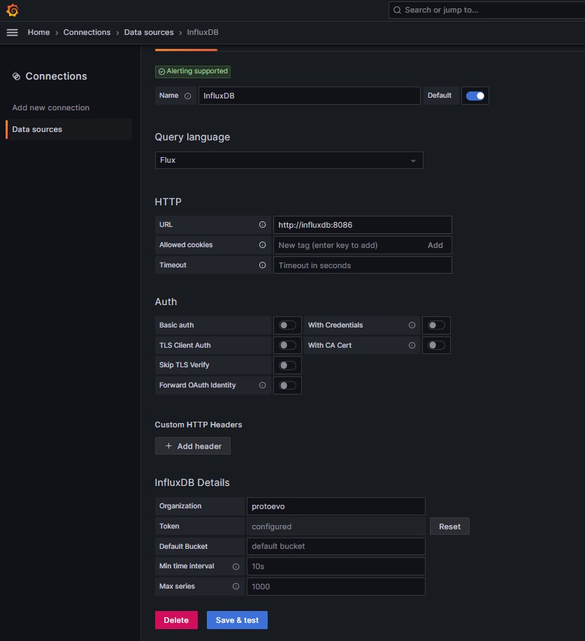
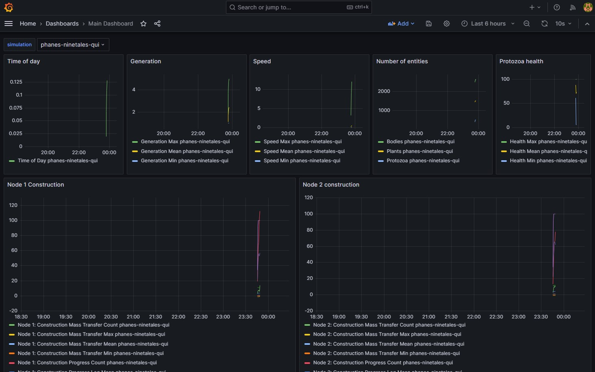
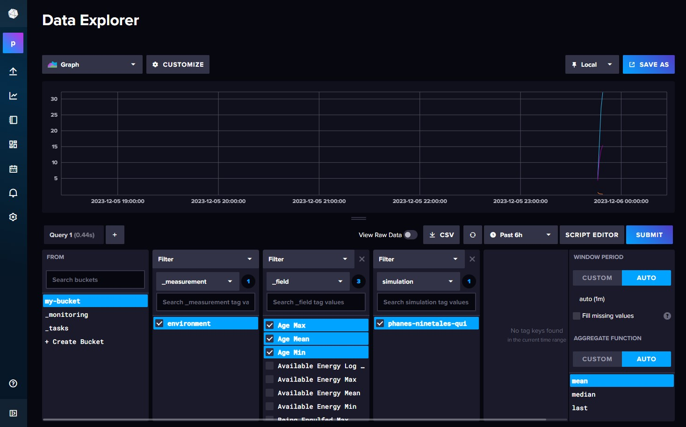
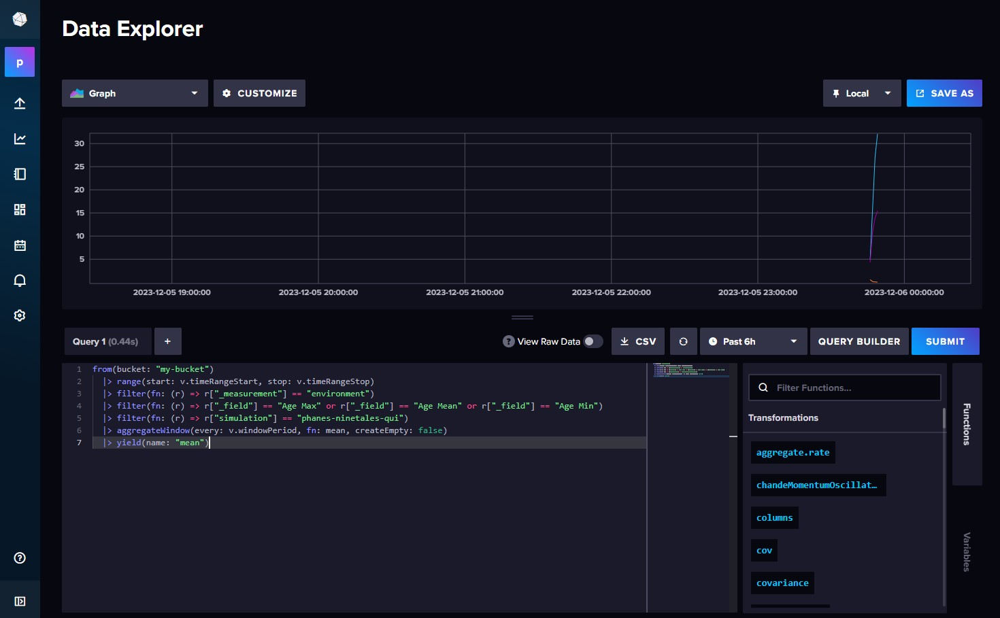

# Stats server
Statistics server consists of two containers, influxdb and grafana. They can be started with docker-compose. The protoevo Java application is configured to send data to the influxdb container.

## Setup
Startup the containers:
(In detached mode)
`docker-compose up -d`

If you wish to look at the logs, you can either omit the `-d` flag or use `docker-compose logs -f`.

### InfluxDB
InfluxDB is available in the url `http://localhost:8086/`, the username is `influx_admin` and the password is `protoevo_influx` as defined in the `docker-compose.yml` file.

### Grafana
Grafana is available in the url `http://localhost:3000/`, the username is `admin` and the password is `stats_grafana` as defined in the `docker-compose.yml` file.

The InfluxDB data source needs to be added manually to Grafana. From the toggle menu, choose connections -> data sources. Then add a new data source. Choose InfluxDB as the type and fill in the following fields:
- Query Language: `Flux`
- URL: `http://influxdb:8086` in HTTP section
- Basic auth: uncheck in Auth section
- Organization: `protoevo` in influxDB Details section
- Token: `my-super-secret-auth-token` in influxDB Details section

Everything else can be left as empty and all auth check boxes can be left unchecked.



Then click save and test. If everything is working, you should see a green notification saying "Data source is working".

Now you can start protoevo and it should start sending data to the database. You can create dashboards and panels to visualize the data.

To verify that data is flowing correctly all the way to Grafana, you can go to the explore tab and run a query. For example, you can run the following query:
```flux
from(bucket: "my-bucket")
  |> range(start: v.timeRangeStart, stop: v.timeRangeStop)
  |> filter(fn: (r) => r["_measurement"] == "environment")
  |> filter(fn: (r) => r["_field"] == "Age Max")
  |> aggregateWindow(every: v.windowPeriod, fn: mean, createEmpty: false)
  |> yield(name: "mean")
```
You should see a graph showing the maximum age of the protozoa over time.

### Importing existing dashboards
There's an example dashboard, `main_dashboard.json`, in the `example_queries` folder. You can import it to Grafana, but first you'll need to change the data source id to match the id of the InfluxDB data source you created earlier. You can find the id by going to the data sources page and clicking on the data source. The id is in the url. For example for a url like `http://localhost:3000/connections/datasources/edit/c7c7acfc-6644-4276-b55e-a0065f069bab` the id is `c7c7acfc-6644-4276-b55e-a0065f069bab`.

All instances of `REPLACE_ME_WITH_CORRECT_ID` in the main_dashboard.json file should be replaced with the id of the InfluxDB data source.

Then you can import the dashboard by going to the dashboard page and clicking on the plus icon on the left. Then choose import and upload the main_dashboard.json file.



### Creating new queries
Understanding `flux` is not necessary to create new queries. If you log in to the InfluxDB UI, you can go to the Data Explorer tab and use Query Builder to create queries. Once you're happy with the query, you can switch to the script editor to see the `flux` code. You can copy the code to Grafana and modify it there.

For example you can create a query that shows Age Max, Age Min and Age Mean with the query builder like this:


And then switch to the script editor to see the `flux` code:


## Shutdown and data deletion
Shutdown the containers with `docker-compose down`. This will keep the data in the volumes. If you wish to delete the data as well, use
`docker-compose down -v`